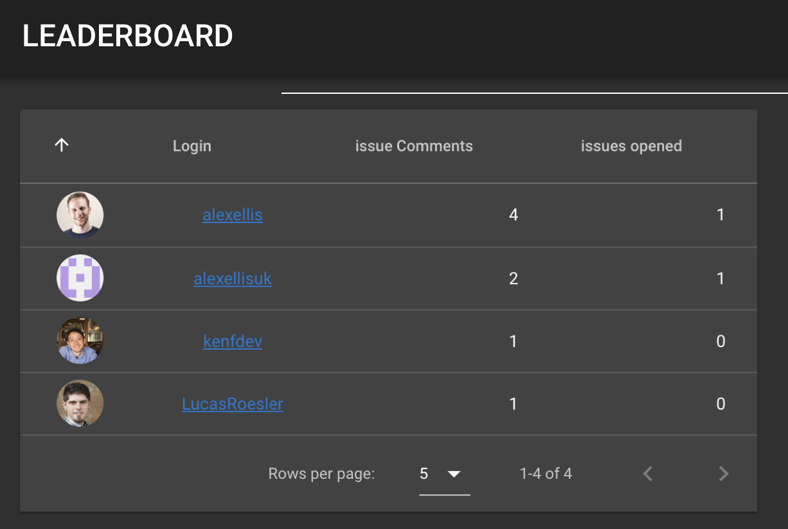
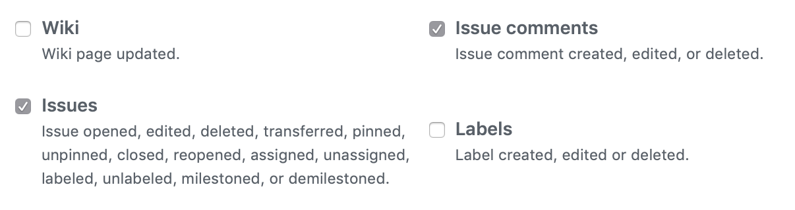

# leaderboard-app - a serverless application

[](https://www.openfaas.com)

This application is an example of how to write a Single Page App (SPA) with a Serverless approach. It provides a live leaderboard for your GitHub organisation or repos showing comments made and issues opened by your community and contributors.

* The front-end is written with Vue.js
* The backing data-store data is Postgres with a remote DBaaS or in-cluster deployment

See a live example tracking the openfaas/openfaas-incubator organizations: [https://alexellis.o6s.io/leaderboard-page](https://alexellis.o6s.io/leaderboard-page)

To test out the functionality comment on this issue: [Issue: Let's test the leaderboard!](https://github.com/openfaas/org-tester/issues/18)

Here's a preview of the app when the dark theme is enabled: 



Subscribe to events by adding a webhook to the github-sub function:



## Blog post / tutorial

Read all the details here on how to build a portable Serverless Single Page App for any cloud:

See also: [Blog: How to build a Serverless Single Page App](https://www.openfaas.com/blog/serverless-single-page-app/)

## Functions

* github-sub

Receives webhooks from GitHub via an organization or repo subscription. Secured with HMAC by Alex Ellis

* leaderboard

Retrieves the current leaderboard in JSON by Alex Ellis

* leaderboard-page

Renders the leaderboard itself as a Vue.js app by Ken Fukuyama

## Schema

* [schema-1.0.sql](sql/schema-1.0.sql)

## Secrets

You can seal your secrets for use with OpenFaaS Cloud:

```
faas-cli cloud seal \
  --name teamserverless-leaderboard-app-secrets \
  --literal=password="$PASS" \
  --literal=username="$USER" \
  --literal=host="$HOST" \
  --literal=webhook-secret="${WEBHOOK}"
```

## Running locally

* Deploy OpenFaaS

The quickest/easiest option is to use Swarm.

* Grab custom templates

```
faas-cli template store pull node8-express
faas-cli template store pull golang-middleware
```

* Create the required secrets

```
export PASS=""
export USER=""
export HOST=""
export WEBHOOK="secret"   # As set on the webhook page on GitHub

# Kubernetes
faas-cli secret create leaderboard-app-secrets-password \
  --from-literal=password="$PASS" \
  --from-literal=username="$USER" \
  --from-literal=host="$HOST" \
  --from-literal=webhook-secret="${WEBHOOK}"

# Swarm

faas-cli secret create password --from-literal="$PASS"
faas-cli secret create username --from-literal="$USER"
faas-cli secret create host --from-literal="$HOST"
faas-cli secret create webhook-secret --from-literal="${WEBHOOK}"

# Then apply each secret to the required function in local.yml
```

* Rename the stack.yml to local.yml

Edit local.yml and rename the functions:

```
leaderboard => alexellis-leaderboard
github-sub => alexellis-github-sub
leaderboard-page => alexellis-leaderboard-page
```

Then add a prefix for each function's Docker image name and run `faas-cli build -f local.yml`

* Deploy `of-router`:

Via: https://github.com/openfaas/openfaas-cloud/tree/master/router

Deploy a fake auth function:

```
faas-cli store deploy figlet
```

Deploy the router:

```
TAG=0.6.0
docker service rm of-router

docker service create --network=func_functions \
 --env upstream_url=http://gateway:8080 \
 --env auth_url=http://figlet:8080 \
 --publish 8081:8080 \
 --name of-router \
 -d openfaas/cloud-router:$TAG
```

* Create entries in: `/etc/hosts`

```
127.0.0.1 alexellis.local-o6s.io
```

* Initialize Postgres

Provision Postgres 10 and set up your initial table schema and function:

```
export CONNECTION_STRING=""
docker run -ti postgres:10 psql ${CONNECTION_STRING}
```

Copy/paste from [schema-1.0.sql](sql/schema-1.0.sql)

* Test the JSON function:

http://127.0.0.1:8080/function/alexellis-leaderboard

* Test the Vue.js page:

http://alexellis.local-o6s.io:8081/leaderboard-page

## Contributing & license

Please feel free to fork and star this repo and use it as a template for your own applications. The license is MIT.

To contribute see [CONTRIBUTING.md](./CONTRIBUTING.md)


