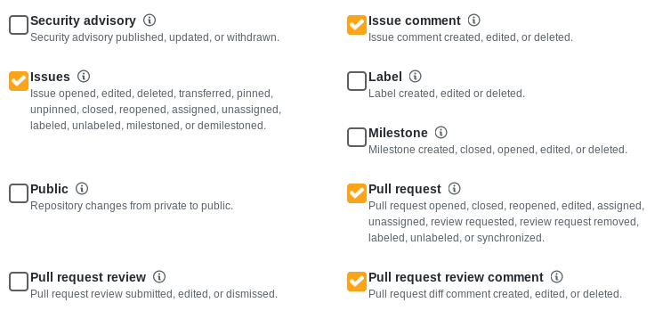

# leaderboard-app - a serverless application

[](https://www.openfaas.com)

This application is a single-page app providing a GitHub leaderboard for your organisation or repo.

Data is stored in postgres using a remote or in-cluster DBaaS.

See a live example tracking the orgs: openfaas/openfaas-incubator: [https://alexellis.o6s.io/leaderboard-page](https://alexellis.o6s.io/leaderboard-page)

To test out the functionality comment on this issue: [Issue: Let's test the leaderboard!](https://github.com/openfaas/org-tester/issues/16)

Dark Leaderboard example


Subscribe to events by adding a webhook to the github-sub function:



## Functions

* github-sub

Receives webhooks from GitHub via an organization or repo subscription. Secured with HMAC by Alex Ellis

* leaderboard

Retrieves the current leaderboard in JSON by Alex Ellis

* leaderboard-page

Renders the leaderboard itself as a Vue.js app by Ken Fukuyama

## Schema

```sql
drop table activity cascade;
drop table users;

CREATE TABLE users (
    user_id         integer PRIMARY KEY NOT NULL,
    user_login      text NOT NULL,
    track           BOOLEAN NOT NULL,
    created_at      timestamp not null
);
insert into users (user_id,user_login,track, created_at) values (653013,'alexellisuk',true,now());
insert into users (user_id,user_login,track, created_at) values (103022,'rgee0',true,now());

CREATE TABLE activity (
    id              INT GENERATED ALWAYS AS IDENTITY,
    user_id         integer NOT NULL references users(user_id),
    activity_type   text NOT NULL,
    activity_date   timestamp NOT NULL,
    owner           text NOT NULL,
    repo            text NOT NULL
);

insert into activity (id,user_id,activity_type,activity_date,owner,repo) values (DEFAULT,653013,'issue_created','2019-02-13 07:44:00','openfaas','org-tester');
insert into activity (id,user_id,activity_type,activity_date,owner,repo) values (DEFAULT,653013,'issue_comment','2019-02-13 07:44:05','openfaas','org-tester');
insert into activity (id,user_id,activity_type,activity_date,owner,repo) values (DEFAULT,653013,'issue_comment','2019-02-12 07:44:05','openfaas','org-tester');
insert into activity (id,user_id,activity_type,activity_date,owner,repo) values (DEFAULT,103022,'issue_comment','2019-02-12 07:44:05','openfaas','org-tester');

select * from activity order by activity_date  asc; 

select a.user_id, a.activity_type, count(a.id) from activity as a
where a.activity_date <= now()
group by (a.user_id, a.activity_type) ;

drop function get_leaderboard;

CREATE or REPLACE FUNCTION get_leaderboard()
    RETURNS TABLE(user_id integer, user_login text, issue_comments bigint, issues_created bigint)
  AS
$$
BEGIN
RETURN QUERY select
    a.user_id,
    u.user_login,
    count(ic.activity_type) as issue_comments,
    count(cm.activity_type) as issues_created
from activity as a
inner join users u
on a.user_id = u.user_id
left outer join activity as ic
on a.user_id= ic.user_id
    and a.activity_type = ic.activity_type
    and a.activity_date = ic.activity_date
    and a.owner = ic.owner
    and a.repo = ic.repo
    and ic.activity_type = 'issue_comment'
left outer join activity as cm
on a.user_id= cm.user_id
    and a.activity_type = cm.activity_type
    and a.activity_date = cm.activity_date
    and a.owner = cm.owner
    and a.repo = cm.repo
    and cm.activity_type = 'issue_created'
where u.track = true
group by a.user_id, u.user_login
order by issue_comments desc, issues_created desc;
END
$$  LANGUAGE 'plpgsql' VOLATILE;

select * from get_leaderboard();

```

